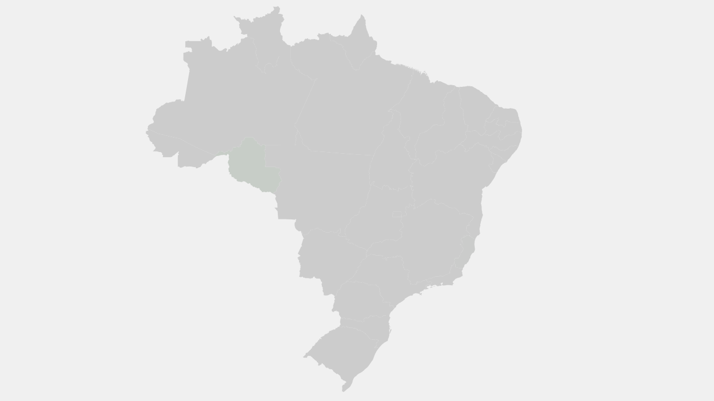

# Interactive SVG Map of Brazil

This project displays a fully responsive and interactive map of Brazil using SVG, CSS, and JavaScript. It allows for easy interaction with each state.

## Features

- **Interactive States**: Hover over any state to see it highlight.
- **Click Events**: Click on any state to trigger a JavaScript alert with its abbreviation.
- **Responsive Design**: The map automatically adjusts to fit the screen size.
- **Modern Stack**: Built with modern web technologies (SVG, CSS3, ES6 JavaScript), replacing an outdated 2012 CSS sprite implementation.

## How to Run Locally

1.  **Clone the repository:**
    ```bash
    git clone https://github.com/your-username/your-repo-name.git
    cd your-repo-name
    ```

2.  **Start a local web server:**
    Since the project uses `fetch` to load the SVG, you need to run it on a local server to avoid CORS issues. A simple way to do this is with Python's built-in HTTP server.

    ```bash
    python3 -m http.server 8000
    ```

3.  **Open in your browser:**
    Navigate to `http://localhost:8000/map.html`.

## Screenshot

Here is a preview of the interactive map with the hover effect active on a state:



## File Structure

- `map.html`: The main HTML file that displays the map.
- `assets/map.svg`: The cleaned and optimized SVG file containing the paths for each Brazilian state.
- `assets/style.css`: The stylesheet for map styling and hover effects.
- `assets/script.js`: The JavaScript file that dynamically loads the SVG and adds interactivity.
- `sources/`: Contains the original source SVG file before processing.
- `add_ids_to_svg.py`: The Python script used to process the source SVG and assign unique IDs to each state.

## History

This project is a complete modernization of an old map of Brazil originally created in 2012 using CSS sprites and GIFs. The new version is more maintainable, scalable, and built with current web standards.
